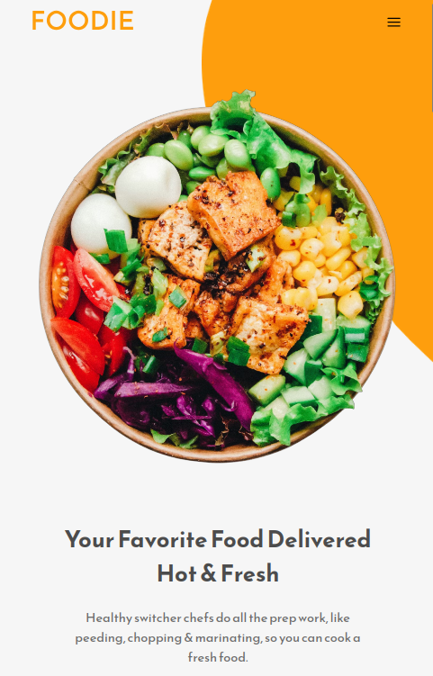
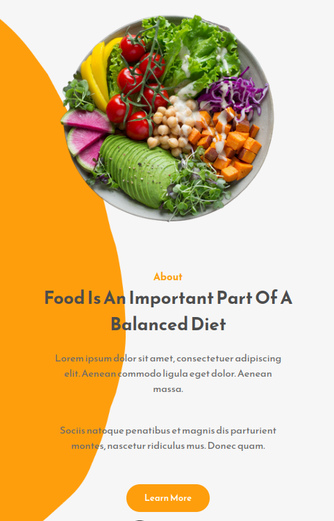

# 🎨 Foodie

A responsive front-end built with vanilla React using simple, clear components.

## 🖌️ Figma Design

[🔗 View Figma](https://www.figma.com/design/oSk3FEZ7qJOTtRjKUJgYDW/Restaurant-Landing-Page-Project-For-Youtube?node-id=0-1&p=f&t=5DkYlKxVAjs8arlw-0)

## 📸 Preview


<p float="left">
  
  
</p>

## 🛠️ Technologies

- React  
- HTML5 & CSS3

## 🚀 Getting Started

```bash
git clone https://github.com/0Flopper/restaurant-landing-page.git
npm install
npm start
